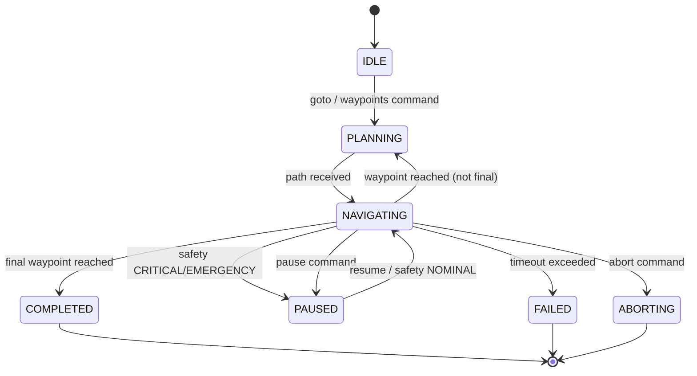

# ANTIGRAVITY — System Architecture

## Overview

ANTIGRAVITY is a GPS-independent autonomous vision-based drone navigation stack built on ROS2 Humble. The system reads a pre-built map, localizes itself using vision and IMU sensors, understands its environment semantically, plans optimal routes, and executes safe flight — all without satellite signal.

## Architecture Layers

```
┌──────────────────────────────────────────────────────────────────┐
│                        SAFETY LAYER (20 Hz)                      │
│    Safety Arbiter → Geofence → System Monitor                    │
│    Can OVERRIDE any command at any time                          │
├──────────────────────────────────────────────────────────────────┤
│                      MISSION MANAGEMENT                          │
│    Mission Manager (goal acceptance, waypoint queue, progress)   │
├──────────────────────────────────────────────────────────────────┤
│                       PLANNING LAYER                             │
│    Global Planner (A*/RRT*)  →  Local Planner (MPC @ 20 Hz)     │
│    RL Decision Layer (PPO) — optional supervisor                 │
├──────────────────────────────────────────────────────────────────┤
│                       CONTROL LAYER                              │
│    Trajectory Optimizer (min-snap)  →  PX4 Bridge (MAVLink)      │
│    EKF State Estimator (100 Hz, 15-state, TF2 broadcast)         │
├──────────────────────────────────────────────────────────────────┤
│                      COGNITION LAYER                             │
│    OctoMap World Model  →  Semantic Segmentation (SAM)           │
│    Prediction Engine (Kalman + Hungarian)                         │
├──────────────────────────────────────────────────────────────────┤
│                    LOCALIZATION LAYER                             │
│    Monte Carlo Localization (100-2000 particles)                 │
│    Likelihood field sensor model, adaptive resampling            │
├──────────────────────────────────────────────────────────────────┤
│                       SLAM LAYER                                 │
│    ORB-SLAM3 (stereo-inertial, 20 Hz)                           │
│    Map point cloud + relocalization                              │
├──────────────────────────────────────────────────────────────────┤
│                     PERCEPTION LAYER                             │
│    Camera (RealSense/ZED @ 30 Hz)  →  IMU (200 Hz)              │
│    Sensor Sync (<2ms alignment)                                  │
│    YOLOv8 Detection (TensorRT FP16)                              │
│    Sensor Diagnostics (rate/health monitoring)                    │
├──────────────────────────────────────────────────────────────────┤
│                        MAP LAYER                                 │
│    Map Server (PGM/YAML, OctoMap .bt)                            │
│    Pre-built environment maps                                    │
└──────────────────────────────────────────────────────────────────┘
```

## Node Connectivity (Mermaid)

```mermaid
graph TB
    subgraph Perception
        CAM[Camera Node] --> SYNC[Sensor Sync]
        IMU[IMU Node] --> SYNC
        DIAG[Sensor Diagnostics]
    end

    subgraph SLAM
        SYNC --> SLAM[ORB-SLAM3]
    end

    subgraph Detection
        CAM --> YOLO[YOLOv8 Detection]
    end

    subgraph Localization
        MAP[Map Server] --> MCL[MCL Node]
        SLAM --> MCL
    end

    subgraph Cognition
        YOLO --> PRED[Prediction Engine]
        CAM --> SEG[Semantic Segmentation]
        SEG --> OCTO[OctoMap World Model]
    end

    subgraph Planning
        MCL --> GP[Global Planner]
        PRED --> LP[Local Planner MPC]
        GP --> LP
        RL[RL Decision] --> LP
        MM[Mission Manager] --> GP
    end

    subgraph Control
        SLAM --> EKF[EKF Estimator]
        MCL --> EKF
        IMU --> EKF
        LP --> TRAJ[Trajectory Optimizer]
        TRAJ --> PX4[PX4 Bridge]
    end

    subgraph Safety
        SA[Safety Arbiter] --> PX4
        GF[Geofence] --> SA
        SM[System Monitor] --> SA
        DIAG --> SA
    end
```

## Mission State Machine



## Data Flow

```
Camera ──┐
         ├──→ Sensor Sync ──→ ORB-SLAM3 ──→ EKF ──→ Local Planner
IMU ─────┘                                    ↑          ↓
                                              │     Trajectory Opt.
Map Server ──→ MCL Localization ──────────────┘          ↓
                    ↓                              PX4 Bridge
              Global Planner ────────────────→ Local Planner
                                                     ↑
YOLOv8 ──→ Prediction Engine ────────────────────────┘
                    ↓
         Semantic Segmentation ──→ OctoMap World Model
                                        ↓
                                  Safety Arbiter ──→ CMD Override
```

## ROS2 Topic Map

### Perception
| Topic | Type | Hz | Publisher | Subscribers |
|-------|------|-----|-----------|-------------|
| `/camera/image_raw` | `sensor_msgs/Image` | 30 | camera_node | slam, detection |
| `/camera/depth` | `sensor_msgs/Image` | 30 | camera_node | slam, world_model |
| `/imu/data` | `sensor_msgs/Imu` | 200 | imu_node | slam, ekf |
| `/perception/sync_status` | `std_msgs/String` | 30 | sensor_sync | — |

### SLAM & Localization
| Topic | Type | Hz | Publisher | Subscribers |
|-------|------|-----|-----------|-------------|
| `/slam/pose` | `geometry_msgs/PoseStamped` | 20 | orb_slam3 | ekf, mcl |
| `/slam/map_points` | `sensor_msgs/PointCloud2` | 1 | orb_slam3 | world_model |
| `/localization/state` | `LocalizationState` | 10 | mcl_node | ekf |
| `/localization/particles` | `ParticleCloud` | 1 | mcl_node | rviz |

### Detection & Cognition
| Topic | Type | Hz | Publisher | Subscribers |
|-------|------|-----|-----------|-------------|
| `/detection/detections` | `DetectionArray` | 15 | yolo_detector | prediction |
| `/cognition/tracked_objects` | `TrackedObjectArray` | 10 | prediction | local_planner |
| `/cognition/predictions` | `PredictedTrajectory` | 10 | prediction | local_planner |
| `/cognition/semantic_map` | `SemanticMap` | 5 | semantic_seg | global_planner |
| `/cognition/occupancy` | `OccupancyGrid` | 2 | world_model | global_planner |

### Planning
| Topic | Type | Hz | Publisher | Subscribers |
|-------|------|-----|-----------|-------------|
| `/planning/global_path` | `WaypointPath` | event | global_planner | traj_optimizer |
| `/planning/rl_action` | `RLAction` | 5 | rl_decision | local_planner |

### Control
| Topic | Type | Hz | Publisher | Subscribers |
|-------|------|-----|-----------|-------------|
| `/control/ekf_state` | `EKFState` | 100 | ekf_estimator | all planners |
| `/control/trajectory` | `Trajectory` | event | traj_optimizer | px4_bridge |
| `/control/trajectory_setpoint` | `TrajectoryPoint` | 50 | traj_optimizer | px4_bridge |
| `/control/cmd_vel` | `geometry_msgs/Twist` | 20 | local_planner | safety_arbiter |
| `/control/cmd_vel_safe` | `geometry_msgs/Twist` | 20 | safety_arbiter | px4_bridge |

### Safety
| Topic | Type | Hz | Publisher | Subscribers |
|-------|------|-----|-----------|-------------|
| `/safety/status` | `SafetyStatus` | 20 | safety_arbiter | bringup |
| `/safety/geofence_status` | `GeofenceStatus` | 5 | geofence | safety_arbiter |
| `/safety/system_health` | `SystemHealth` | 2 | system_monitor | safety_arbiter |

## Package Dependency Graph

```
antigravity_interfaces (msgs/srvs/actions)
    ↓
antigravity_perception (camera, IMU, sync, diagnostics)
    ↓
antigravity_slam (ORB-SLAM3)
    ↓
antigravity_detection (YOLOv8)
    ↓
antigravity_mapping (map server)
    ↓
antigravity_localization (MCL particle filter)
    ↓
antigravity_cognition (world model, semantics, prediction)
    ↓
antigravity_planning (A*, MPC, RL, mission manager)
    ↓
antigravity_control (EKF + TF2, trajectory optimizer, PX4 bridge)
    ↓
antigravity_safety (arbiter, geofence, monitor)
    ↓
antigravity_bringup (launch files, configs)
```

## Hardware Requirements

| Component | Specification | Purpose |
|-----------|--------------|---------|
| **Companion Computer** | NVIDIA Jetson Orin NX 16GB | All compute |
| **Flight Controller** | Pixhawk 6C | PX4 autopilot |
| **Camera** | Intel RealSense D435i | Stereo + depth + IMU |
| **IMU** | Built-in (D435i) or external MPU-9250 | 200 Hz inertial |
| **Connection** | USB3 (camera) + UART (FC) | Data links |

## Configuration Files

All tunable parameters are in `src/antigravity_bringup/config/`:

| File | Covers |
|------|--------|
| `perception.yaml` | Camera resolution, IMU rates, sync tolerances |
| `slam.yaml` | ORB-SLAM3 features, stereo baseline, vocabulary path |
| `detection.yaml` | YOLOv8 model path, TensorRT settings, class list |
| `localization.yaml` | MCL particle count, sensor model, resampling |
| `cognition.yaml` | OctoMap resolution, semantic classes, prediction horizon |
| `planning.yaml` | A*/RRT* params, MPC horizon, RL model path |
| `mission.yaml` | Goal tolerance, waypoint queue, mission timeout |
| `control.yaml` | PX4 FCU URL, PID gains, offboard rates |
| `ekf.yaml` | EKF noise models, sensor weights, trajectory constraints |
| `safety.yaml` | Battery thresholds, geofence bounds, collision distances |
| `diagnostics.yaml` | Sensor minimum rates, health thresholds |
